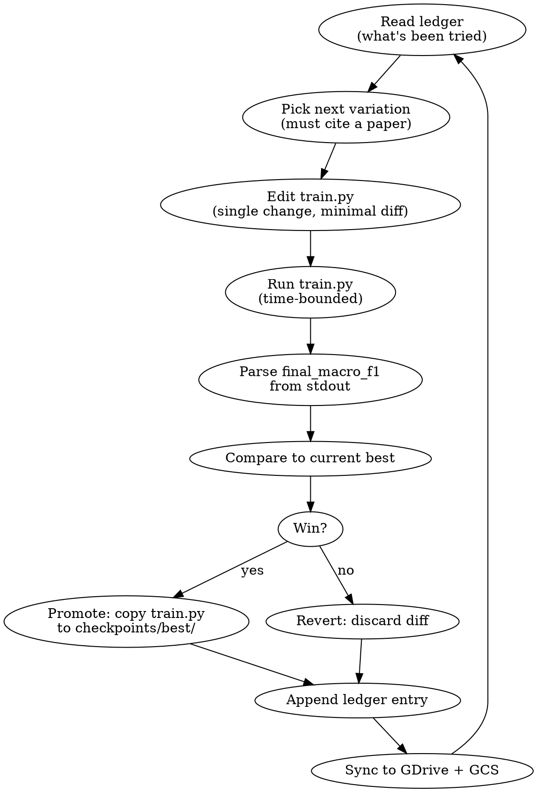

# AutoLearnMeds: Pharma-VLM Autoresearch — Design Specification

## Abstract

We design a research system that **automatically discovers training and architectural improvements** for a custom vision-language model (VLM) tasked with extracting structured information (medicine name, batch number, MRP, manufacturing date, manufacturer, packaging type, etc.) from images of pharmaceutical products. The system adapts Andrej Karpathy's `autoresearch` methodology (Karpathy 2026): an AI agent autonomously edits a single-file training script `train.py`, runs time-bounded experiments, measures a single scalar metric (validation macro-F1 of field extraction), keeps wins, discards losses, and logs everything in a reproducible ledger. The model itself is hybrid: a frozen pretrained `google/siglip-base-patch16-224` (Zhai et al. 2023) vision encoder feeds a small (~50M parameter) Donut-style autoregressive decoder (Kim et al. 2022) trained from scratch. Training runs on Google Colab Pro+ A100 GPUs, with VSCode connected via SSH-over-Cloudflare-Tunnel for direct agent control. Persistence is three-way redundant (Google Drive + GCS + GitHub). The system is resilient to Colab disconnects and Claude rate-limit interruptions through atomic experiment transactions and a deterministic resume-or-start state machine. Every experiment logs a paper-cited rationale; tables, figures, and BibTeX for the final research paper are auto-generated from the experiment ledger.

---

## Table of Contents

- [§1 Research Goal & Optimization Metric](#section-1--research-goal--optimization-metric)
- [§2 System Architecture & Folder Structure](#section-2--system-architecture--folder-structure)
- [§3 Data Pipeline](#section-3--data-pipeline)
- [§4 Model: SigLIP Encoder + Donut-Style Decoder](#section-4--model-siglip-encoder--donut-style-decoder)
- [§5 Autoresearch Harness](#section-5--autoresearch-harness)
- [§6 Colab Pro+ + VSCode SSH Tunnel](#section-6--colab-pro--vscode-ssh-tunnel)
- [§7 Backup, Resilience & Rate-Limit Handling](#section-7--backup-resilience--rate-limit-handling)
- [§8 Documentation & Paper Generation](#section-8--documentation--paper-generation)
- [§9 Phased Rollout & Testing](#section-9--phased-rollout--testing)
- [Appendix A — Citation Registry](#appendix-a--citation-registry)
- [Appendix B — User-Confirmed Decisions](#appendix-b--user-confirmed-decisions)
- [Appendix C — Open Items / Provisional](#appendix-c--open-items--provisional)

---

## Section 1 — Research Goal & Optimization Metric

### 1.1 Research goal (one sentence)

Improve the accuracy of structured information extraction from pharmaceutical product label images, using a hybrid frozen-encoder + trainable-decoder VLM, where architectural and training choices are discovered by an autonomous agent following Karpathy-style (Karpathy 2026) autoresearch methodology.

### 1.2 Fields to extract (provisional — finalized in Phase 1)

| Field | Type | Notes |
|---|---|---|
| `medicine_name` | string | e.g., "Paracetamol 500mg" |
| `medicine_type` | enum | `tablet | capsule | vial | bottle | syrup | injection | ointment | other` |
| `packaging_type` | enum | `blister_strip | bottle | box | sachet | ampoule | other` |
| `batch_number` | string | alphanumeric |
| `mrp` | numeric + currency | parsed to canonical decimal + ISO currency |
| `mfg_date` | ISO date (YYYY-MM or YYYY-MM-DD) | normalized |
| `expiry_date` | ISO date | normalized |
| `manufacturer` | string | normalized lowercase |
| `logo_present` | bool | binary classification |

This list is provisional. Final field list is locked in Phase 1 once the user shares the golden_set; field names and value formats will be derived from the actual data, not guessed (see §3 and Appendix C).

### 1.3 Primary metric (single scalar — what the agent optimizes)

**`val_macro_f1`** — macro-F1 averaged across all fields, with field-aware normalization applied before scoring (lowercase, whitespace-strip, ISO-date parse for date fields, currency parse for MRP).

- Range: [0, 1]; higher is better.
- Reported by `train.py` as the literal stdout line `final_macro_f1=X.XXXX` on the last line of training.
- Single scalar so the agent has an unambiguous optimization target — mirrors `val_bpb` in nanochat-autoresearch.

### 1.4 Secondary metrics (logged, not optimized)

| Metric | Purpose |
|---|---|
| Per-field F1 | breakdown table for paper |
| Per-field exact-match accuracy | strict baseline reference |
| Per-field normalized character error rate (CER) | partial-credit view |
| Inference latency per image | reported in paper, not optimized in agent loop |
| Trainable parameter count | reported in paper |
| FLOPs per forward | reported in paper |

### 1.5 Why macro-F1, not exact-match

Macro-F1 treats every field equally regardless of frequency. Without it, the agent could maximize accuracy by ignoring rare-but-critical fields (e.g., batch number on degraded images). Lipton et al. 2014 ("Optimal Thresholding of Classifiers to Maximize F1 Measure", arXiv:1402.1892) establish F1 as the right target when class imbalance and partial credit both matter. Exact-match accuracy is reported as a strict baseline but does not drive the agent.

### 1.6 Held-out test set discipline

The test set is **frozen on day one** (Phase 1). The agent never sees it; it can only access train + val. Final paper numbers come from one test-set evaluation per major checkpoint, not per experiment. This prevents the agent from overfitting to test through repeated exposure. See §3.3 and §5.7 for enforcement mechanisms.

---

## Section 2 — System Architecture & Folder Structure

### 2.1 Three-layer architecture

```
┌─────────────────────────────────────────────────────────────┐
│  Layer 3 — Autoresearch Harness                             │
│  (agent reads program.md, edits train.py, runs experiments, │
│   logs to ledger, keeps wins, discards losses)              │
└─────────────────────────────────────────────────────────────┘
               │ writes/reads
               ▼
┌─────────────────────────────────────────────────────────────┐
│  Layer 2 — Single-File Training Script (train.py)           │
│  ┌─────────────────────────────────────────────────────┐    │
│  │ SigLIP encoder (frozen) ──> 196 patch tokens        │    │
│  │   │                                                 │    │
│  │   ▼ cross-attention                                 │    │
│  │ Donut-style decoder (~50M, trainable)               │    │
│  │   │                                                 │    │
│  │   ▼                                                 │    │
│  │ Structured XML-tagged output tokens                 │    │
│  └─────────────────────────────────────────────────────┘    │
└─────────────────────────────────────────────────────────────┘
               │ reads
               ▼
┌─────────────────────────────────────────────────────────────┐
│  Layer 1 — Data + Persistence (GDrive + GCS + W&B + GitHub) │
│  images, YOLO labels, transcriptions, checkpoints,          │
│  experiment ledger, paper artifacts                         │
└─────────────────────────────────────────────────────────────┘
```

### 2.2 Folder structure on Colab (mounted from Google Drive for persistence)

```
AutoLearnMeds/
├── README.md                          # human-facing overview
├── pyproject.toml                     # uv-managed deps (matches autoresearch convention)
├── uv.lock
├── .python-version
├── .gitignore
├── RESUME_NEEDED.md                   # written by agent on clean shutdown (rate-limit / disconnect); read by next session
│
├── prepare.py                         # FIXED — data prep, dataloader, eval
├── train.py                           # AGENT-EDITED — model + training loop
├── program.md                         # HUMAN-EDITED — autoresearch instructions
├── program_explore.md                 # phase-1 fast experiments
├── program_confirm.md                 # phase-2 long experiments
│
├── data/
│   ├── raw/                           # symlink to GDrive mount
│   ├── processed/
│   │   ├── train.jsonl
│   │   ├── val.jsonl
│   │   └── test.jsonl                 # FROZEN, never touched by agent
│   └── data_card.md                   # dataset documentation for paper
│
├── checkpoints/                       # symlink to GDrive — survives Colab shutdown
│   ├── best/                          # best-by-macro-F1 checkpoint
│   └── runs/<run_id>/                 # per-experiment checkpoints
│
├── experiments/                       # the autoresearch ledger
│   ├── ledger.jsonl                   # one line per experiment
│   ├── runs/<run_id>/
│   │   ├── train.py                   # snapshot of the script for this experiment
│   │   ├── config.yaml
│   │   ├── metrics.json
│   │   ├── stdout.log
│   │   └── notes.md                   # agent-written rationale + citations
│   ├── _active.json                   # current planned/active experiment
│   └── leaderboard.md                 # auto-regenerated ranked table
│
├── papers/                            # downloaded PDFs of every cited reference
│   ├── README.md                      # citation registry
│   ├── karpathy_2026_autoresearch.md  # markdown summary (repo, not paper)
│   └── *.pdf                          # one per academic citation
│
├── paper/                             # the research paper itself
│   ├── main.tex
│   ├── refs.bib                       # auto-synced from papers/README.md
│   ├── figures/                       # auto-generated
│   ├── tables/                        # auto-generated
│   └── sections/
│
├── scripts/
│   ├── colab_bootstrap.sh             # one-command Colab setup
│   ├── colab_ssh.py                   # cloudflare tunnel for VSCode
│   ├── keepalive.py                   # prevents idle disconnect
│   ├── sync_to_gcs.sh                 # periodic backup to GCS bucket
│   ├── resume_or_start.py             # checkpoint-aware launcher
│   ├── build_processed.py             # raw → processed JSONL
│   ├── build_data_card.py             # auto-generate data card
│   ├── build_paper_artifacts.py       # tables + figures from ledger
│   ├── build_bibtex.py                # papers/ → refs.bib
│   ├── build_research_log.py          # weekly research-log narrative
│   ├── leaderboard.py                 # ledger → leaderboard.md
│   ├── promote.sh                     # promote a winning experiment
│   ├── run_experiment.sh              # canonical experiment runner
│   ├── disaster_recover.sh            # pull from GCS + GitHub
│   ├── daily_snapshot.sh              # tar to GCS
│   ├── check_test_lock.py             # verify test set hash
│   ├── check_paper_claims.py          # find unsourced claims in LaTeX
│   ├── check_significance.py          # statistical-sig checks for confirm
│   └── update_ssh_config.sh           # refresh ~/.ssh/config after Colab restart
│
├── notebooks/
│   └── 00_bootstrap.ipynb             # one-cell Colab launcher
│
├── docs/
│   └── superpowers/
│       └── specs/
│           └── 2026-05-05-pharma-vlm-autoresearch-design.md  # this file
│
└── tests/
    ├── test_data.py
    ├── test_model.py
    ├── test_eval.py
    ├── test_resume.py
    ├── test_ledger_integrity.py
    └── test_disaster_recovery.py
```

### 2.3 Three-file discipline (mirrors autoresearch)

1. **`prepare.py` — never modified.** Defines the rules of the game: dataset loading, tokenizer, dataloader, canonical `evaluate()` function. The agent must not touch this.
2. **`train.py` — agent edits this.** Contains SigLIP loader, decoder, optimizer, training loop, and `__main__` block that prints `final_macro_f1=X.XXXX`. Everything else is fair game.
3. **`program.md` — human (user) edits this.** Tells the agent the metric, time budget, source-vetting rule, citation requirement, allowed/forbidden actions.

### 2.4 Why this structure

- Mirrors `autoresearch`'s minimal three-file contract; gives the agent a clean, simple rulebook.
- Separates fixed (`prepare.py`, `data/test.jsonl`) from mutable (`train.py`, `program.md`) — protects research integrity.
- Every experiment is reproducible: `experiments/runs/<run_id>/train.py` snapshot + `config.yaml` reproduces bit-for-bit.
- Paper artifacts auto-generate from the ledger — minimizes "what did we run again?" archaeology.

---

## Section 3 — Data Pipeline

### 3.1 Data sources & access

| Source | Mounted as | Contents |
|---|---|---|
| Google Drive (existing folder) | `/content/drive/MyDrive/AutoLearnMeds/raw/` | Original images + YOLO `.txt` labels + transcription file |
| GCS bucket | `/mnt/gcs/` (via `gcsfuse`) | Same data, mirror — read-only on Colab; canonical backup |

`scripts/colab_bootstrap.sh` mounts both every Colab session. Drive is primary (faster I/O); GCS is the disaster-recovery mirror.

### 3.2 Canonical data format — PROVISIONAL until golden_set available

Per the user's request (2026-05-05), the canonical schema **will be derived from the actual golden_set** rather than guessed. This subsection shows the *target shape* — the actual field names, value normalization rules, and edge-case handling are locked in Phase 1.

Provisional shape, one line per image in `processed/{train,val,test}.jsonl`:

```json
{
  "image_id": "img_00042",
  "image_path": "raw/images/img_00042.jpg",
  "image_hash": "sha256:abc...",
  "fields": {
    "medicine_name":   {"value": "Paracetamol 500mg", "present": true},
    "medicine_type":   {"value": "tablet",            "present": true},
    "packaging_type":  {"value": "blister_strip",     "present": true},
    "batch_number":    {"value": "BX2024A",           "present": true},
    "mrp":             {"value": "45.00",             "present": true, "currency": "INR"},
    "mfg_date":        {"value": "2024-03",           "present": true},
    "expiry_date":     {"value": "2026-02",           "present": true},
    "manufacturer":    {"value": "ABC Pharma Ltd",    "present": true},
    "logo_present":    {"value": true,                "present": true}
  },
  "boxes": [
    {"field": "medicine_name", "yolo": [0.51, 0.18, 0.42, 0.07]},
    {"field": "batch_number",  "yolo": [0.22, 0.71, 0.13, 0.04]}
  ],
  "split": "train",
  "provenance": {"source": "user_dataset_v1", "captured_date": "2024-..."}
}
```

`scripts/build_processed.py` performs the conversion (run once + on data-version bumps). Hash-locks each image so test-set leakage is detectable.

### 3.3 Train / val / test split

- **80 / 10 / 10**, stratified by `manufacturer` so all three splits see the same manufacturer distribution (prevents memorizing manufacturer-specific layouts).
- **Test set is hash-locked.** `test.jsonl` contains image hashes. `prepare.py` raises `RuntimeError` if anything tries to load test data outside the gated `evaluate_test()` callable, which the agent's `train.py` cannot import.
- Split generated with fixed seed (`split_seed=20260504`) and committed to git so re-running produces an identical split forever.

### 3.4 Output tokenization

Decoder emits XML-tagged sequences à la Donut (Kim et al. 2022, §3.2):

```
<s>
  <medicine_name>Paracetamol 500mg</medicine_name>
  <medicine_type>tablet</medicine_type>
  <batch_number>BX2024A</batch_number>
  <mrp>45.00</mrp>
  <mfg_date>2024-03</mfg_date>
  <manufacturer>ABC Pharma Ltd</manufacturer>
  <logo_present>true</logo_present>
</s>
```

**Tokenizer:** custom byte-pair-encoding (BPE), vocab size 8192, trained once on `train.jsonl` outputs in `prepare.py`. Special tokens: `<s>`, `</s>`, plus one open/close pair per field. Vocab is frozen after `prepare.py` runs once — the agent cannot retrain it (would invalidate cross-experiment metric comparability).

**Why XML tags vs raw JSON:** Donut showed cleaner gradients vs. JSON braces because every field gets its own dedicated tokens. We follow Donut precisely so comparison to that paper is honest.

### 3.5 Image preprocessing

- Resize to 224×224 (SigLIP-base native resolution).
- Letterbox: preserve aspect ratio with gray padding (medicine boxes are often non-square).
- Normalize with SigLIP's own mean/std (from `transformers.AutoProcessor`).

**Augmentation:** none in baseline. Agent can add augmentations and must cite source for each (e.g., RandAugment — Cubuk et al. 2020; AugMix — Hendrycks et al. 2020). Each augmentation tried = one ledger entry.

### 3.6 Dataloader (in `prepare.py`)

```python
def get_dataloader(split: str, batch_size: int, shuffle: bool) -> DataLoader: ...

def evaluate(model, split: str = "val") -> dict:
    """Returns {
        'macro_f1': float,
        'per_field_f1': {...},
        'per_field_em': {...},
        'cer': float,
        ...
    }"""
```

`evaluate()` is the agent's *only* legal way to get a number. It also normalizes fields (lowercase strings, ISO dates, parsed currency) before scoring — agent cannot game F1 via output capitalization tricks.

### 3.7 Data card (for the paper)

`data/data_card.md` — auto-generated by `scripts/build_data_card.py` following Gebru et al. 2018 ("Datasheets for Datasets"). Reports total images, per-field presence rates, manufacturer distribution histogram, image-resolution distribution, split sizes, hash counts. Re-run on every data-version bump.

---

## Section 4 — Model: SigLIP Encoder + Donut-Style Decoder

### 4.1 Vision encoder (frozen)

- **Checkpoint:** `google/siglip-base-patch16-224`
- **Source:** Zhai et al. 2023, "Sigmoid Loss for Language Image Pre-Training" (arXiv:2303.15343)
- **Why frozen:** keeps trainable parameters small (decoder only, ~50M), keeps experiments fast, and isolates what the agent is actually optimizing (decoder + training, not encoder).
- **Output:** 196 patch embeddings of dim 768 from a 224×224 image (16×16 patches), no [CLS] token used.
- **Why SigLIP-base over CLIP-base:** SigLIP's sigmoid loss yields sharper, more localized patch features (Zhai 2023, Table 4) — important when the model must attend to small text regions.

### 4.2 Decoder (trainable, ~50M params, baseline)

A 6-layer GPT-style decoder with cross-attention to the 196 vision tokens — standard Donut decoder architecture (Kim et al. 2022, §3.1).

| Component | Baseline | Citation / source |
|---|---|---|
| Layers | 6 | Donut-base uses 4; we start at 6 for our smaller decoder vocab. Agent may sweep. |
| Hidden dim | 512 | (Donut-base = 1024; we shrink for fast iteration on Colab) |
| Heads | 8 | head_dim = 64, standard |
| FFN ratio | 4× | Vaswani et al. 2017 default |
| Activation | GELU | Hendrycks & Gimpel 2016 |
| Position encoding | RoPE | Su et al. 2021 (RoFormer) — better length generalization |
| Cross-attention | every layer | Donut convention |
| Causal mask | yes | autoregressive decoding |
| Dropout | 0.1 | regularization baseline |
| Tied input/output embeddings | yes | param savings, Press & Wolf 2017 |

### 4.3 Forward pass

```
image (3, 224, 224)
  → SigLIP.vision_model (frozen)
  → patch_tokens (196, 768)
  → linear projection 768→512 (trainable)
  → kv for cross-attention

prefix tokens (<s>, prompt)
  → embed (vocab=8192, dim=512)
  → 6× DecoderBlock(self-attn → cross-attn → FFN, RoPE, residual+LN)
  → linear → vocab logits
```

### 4.4 Training objective

- **Loss:** standard next-token cross-entropy on the structured output sequence (teacher-forcing).
- **Label smoothing:** 0.0 baseline (Szegedy et al. 2016) — agent may try 0.1.
- **Token weighting:** none in baseline; agent may try down-weighting structural tokens (open/close tags) so the model focuses on field values. Cited from Donut §3.3 which notes structural tokens dominate loss.

### 4.5 Optimizer & schedule (baseline)

- **Optimizer:** AdamW (Loshchilov & Hutter 2019), `betas=(0.9, 0.95)`, `weight_decay=0.05` — same as nanoGPT/nanochat baseline.
- **LR schedule:** cosine with linear warmup. Warmup 500 steps; peak LR `3e-4`; min LR `3e-5`.
- **Gradient clipping:** 1.0 global norm.
- **Batch size:** 16 (A100 should fit comfortably with bf16; agent can grow this).
- **Precision:** bf16 mixed precision (PyTorch native AMP).

### 4.6 Allowed agent edits in `train.py`

✅ **Architecture:** layers, hidden dim, heads, FFN ratio, activation, dropout, position encoding, cross-attention pattern, layer-norm placement (pre vs post), tied embeddings flag.
✅ **Optimizer:** AdamW vs Lion vs Muon, betas, weight decay, schedule shape, warmup, peak LR.
✅ **Loss:** label smoothing, token weighting, auxiliary losses (e.g., field-presence classification head).
✅ **Augmentations & data:** RandAugment, AugMix, hard-example mining, curriculum, oversampling rare manufacturers.
✅ **Tokenization-strategy variants** that don't retrain the BPE (e.g., adding `<no_value>` token via vocab reserve slots).

❌ **Forbidden:** modifying `prepare.py`, modifying `evaluate()`, retraining the BPE tokenizer, changing the test set, looking at test data, changing the metric definition, swapping the encoder out of SigLIP family without a new top-level run-tag.

### 4.7 Why this design supports the autoresearch loop

- **Small enough:** ~50M trainable params — A100 trains 1 epoch on ~10k images in ~3–5 minutes, fitting the explore-phase budget.
- **Many independent knobs:** dozens of citable directions, each ledger-able.
- **Reproducible:** every knob has a paper to cite.

---

## Section 5 — Autoresearch Harness

### 5.1 The agent's role

The "agent" is a Claude Code session (the user's local VSCode connected via SSH to the Colab VM, optionally re-spawned via `schedule` skill cron) that follows `program.md`. **Not a separately deployed system** — same pattern as Karpathy 2026.

### 5.2 The agent's contract (per experiment)

Every experiment is one tight cycle:



**Hard rules** (enforced in `program.md` and by `prepare.py` checks):

1. Every variation cites at least one paper from `papers/` or adds a new paper to `papers/` with a one-paragraph summary.
2. Change must be a single, minimal diff — no shotgun changes ("one knob per experiment").
3. Agent must run `pytest tests/` and confirm green before committing.
4. Agent must write `experiments/runs/<run_id>/notes.md` with: hypothesis, change, citation, predicted direction, observed result, retrospective.
5. Agent never edits `prepare.py`, never reads `data/test.jsonl`, never invokes `evaluate_test()`.
6. After every experiment, agent commits to git (local) and pushes to GitHub.

### 5.3 `program.md` skeleton

```markdown
# Pharma-VLM Autoresearch

## Goal
Maximize val macro_f1 of structured field extraction from pharmaceutical
label images, by iterating on train.py.

## Metric
Single scalar: val_macro_f1. Higher is better. Reported by train.py as
`final_macro_f1=X.XXXX` on the last line of stdout.

## Time budget
Phase 1 (explore): 15 min wall-clock per experiment.
Phase 2 (confirm): 60 min wall-clock per experiment.

## Allowed / forbidden
[See §4.6 of design]

## Source vetting
Every change cites a paper. Add new PDFs to papers/ if you cite something new.
If a change is heuristic (no paper), label it `--exploratory--` and run it
under a separate run-tag.

## Workflow per experiment
1. Read experiments/ledger.jsonl tail; pick a direction not recently tried.
2. Edit train.py with a minimal diff.
3. Add citation to experiments/runs/<run_id>/notes.md.
4. Run: bash scripts/run_experiment.sh
5. Read final metric from logs.
6. If improved over current best: bash scripts/promote.sh <run_id>
   Else: leave train.py reverted.
7. Append ledger; commit; push.

## Backup
After every experiment, scripts/sync_to_gcs.sh runs automatically.
If Colab disconnects, scripts/resume_or_start.py picks up where you left off.
```

`program_explore.md` adds: "prefer fast knob sweeps (LR, batch size, dropout, augmentation toggles)."
`program_confirm.md` adds: "only re-run what explore found promising; longer time budget; report mean ± std over 3 seeds."

### 5.4 Experiment ledger (`experiments/ledger.jsonl`)

Append-only JSON-lines, one entry per experiment, single source of truth:

```json
{
  "run_id": "20260505-1742-rope-vs-alibi",
  "phase": "explore",
  "parent_run_id": "20260505-1601-baseline",
  "hypothesis": "ALiBi (Press 2022) handles longer label sequences better than RoPE for pharma labels with many fields",
  "citation": ["press_2022_alibi.pdf"],
  "diff_summary": "Replaced RoPE with ALiBi in decoder self-attention",
  "diff_path": "experiments/runs/20260505-1742-rope-vs-alibi/train.py.patch",
  "config": {"layers": 6, "hidden": 512, "heads": 8, "lr": 3e-4},
  "wall_clock_min": 14.2,
  "gpu": "A100-40GB",
  "metrics": {
    "final_macro_f1": 0.7821,
    "per_field_f1": {"medicine_name": 0.91, "batch_number": 0.62},
    "cer": 0.084,
    "trainable_params": 50312704
  },
  "best_at_time_of_run": 0.7798,
  "kept": true,
  "rationale": "+0.0023 macro_f1, biggest gain on batch_number field",
  "notes_path": "experiments/runs/20260505-1742-rope-vs-alibi/notes.md",
  "git_sha": "a3f9c1d",
  "timestamp": "2026-05-05T17:42:11Z"
}
```

`scripts/leaderboard.py` re-renders `experiments/leaderboard.md` on every append.

### 5.5 Win/loss decision rule (two-tier)

- **Explore phase:** keep if `new_macro_f1 > current_best + ε` where `ε = 0.001`. Fast, noisy.
- **Confirm phase:** every promising explore result re-run with N=3 seeds at 60-min budget; promote only if mean is better and 95% confidence intervals don't overlap.
- Paper reports only confirm-phase numbers as final results.

### 5.6 Stopping criterion

Agent runs until ANY of:

- Compute budget consumed (configurable, e.g., $X compute units).
- No improvement for K consecutive experiments (default K=20 in explore, K=5 in confirm).
- User says stop.

Each session writes `session_summary.md` when stopping.

### 5.7 Safety rails

- **Test-set firewall:** `prepare.py` raises `RuntimeError` if anything tries to load test data outside the gated `evaluate_test()`. That function logs every call to `evaluate_test_audit.log`.
- **Metric-tampering firewall:** `evaluate()` is hashed at session start; if file changes mid-session, agent's output is rejected.
- **Git fail-safe:** every experiment is a commit. `git reset --hard <last-good-sha>` recovers in seconds.
- **Colab idle disconnect:** `scripts/keepalive.py` + `scripts/resume_or_start.py` cap loss at one in-flight experiment.

---

## Section 6 — Colab Pro+ + VSCode SSH Tunnel

### 6.1 Why this matters for autoresearch

For the agent (Claude Code session) to run experiments unattended, it needs:

- Direct shell access to the Colab GPU machine (run/kill processes, `tail -f` logs, edit files in place).
- File access (read/write `train.py`, `experiments/`, `checkpoints/`).
- Output access (read stdout of running training jobs).

VSCode Remote-SSH gives all three. Browser Colab only gives the human user a UI; it doesn't give Claude Code a controllable terminal. SSH is required.

### 6.2 Connection chain

```
Mac ── VSCode Remote-SSH ── Cloudflare Tunnel ── colab.google.com VM ── A100
                                                  │
                                            Claude Code (agent)
                                            reads/writes files
                                            runs train.py
                                            reads metrics
```

### 6.3 Tools (source-vetted)

| Tool | Purpose | Source |
|---|---|---|
| `colab-ssh` | Bootstraps OpenSSH inside Colab + Cloudflare Tunnel | github.com/WassimBenzarti/colab-ssh (MIT) |
| Cloudflare Tunnel (`cloudflared`) | Public hostname → SSH port; no account needed for `trycloudflare` quick tunnels | developers.cloudflare.com/cloudflare-one |
| VSCode Remote-SSH extension | Native SSH client | code.visualstudio.com/docs/remote/ssh |
| Colab Pro+ background execution | Keeps runtime alive after closing browser tab | colab.research.google.com (Pro+ feature) |

**Alternative considered: ngrok** — requires account + auth token, free tier session-limited. Cloudflare quick tunnels picked because zero setup and don't expire mid-session.

### 6.4 Bootstrap flow (once per Colab session)

User opens `notebooks/00_bootstrap.ipynb`, runs one cell:

```python
!curl -sSL https://raw.githubusercontent.com/<user>/<repo>/main/scripts/colab_bootstrap.sh | bash
```

That script (`scripts/colab_bootstrap.sh`):

```bash
#!/usr/bin/env bash
set -euo pipefail

# 1. Mount Google Drive (interactive auth on first run)
python -c "from google.colab import drive; drive.mount('/content/drive')"

# 2. Mount GCS bucket via gcsfuse
gcloud auth application-default login --no-browser    # one-time
mkdir -p /mnt/gcs
gcsfuse <bucket-name> /mnt/gcs

# 3. Symlink working dir so paths are stable across sessions
ln -sfn /content/drive/MyDrive/AutoLearnMeds /workspace
cd /workspace

# 4. Install uv + sync deps
curl -LsSf https://astral.sh/uv/install.sh | sh
source $HOME/.local/bin/env
uv sync

# 5. SSH server + Cloudflare Tunnel
pip install -q colab-ssh
python -c "
from colab_ssh import launch_ssh_cloudflared
launch_ssh_cloudflared(password='<temp-password>')
"
# Prints: SSH command, hostname, port — copy to ~/.ssh/config

# 6. Background daemons
nohup python scripts/keepalive.py > /tmp/keepalive.log 2>&1 &
nohup bash scripts/sync_to_gcs.sh > /tmp/sync.log 2>&1 &

# 7. Success banner
echo "READY — connect VSCode to: ssh root@<cloudflared-host>"
```

User pastes hostname into Mac `~/.ssh/config`:

```
Host autolearnmeds-colab
    HostName <cloudflared-host>.trycloudflare.com
    User root
    ProxyCommand /usr/local/bin/cloudflared access ssh --hostname %h
```

VSCode: ⌘⇧P → "Remote-SSH: Connect to Host" → `autolearnmeds-colab`.

### 6.5 Surviving Colab restarts

Cloudflared hostname changes per session (quick-tunnel limitation; deterministic hostnames need a paid Cloudflare account, optional later). On Colab restart:

1. Re-run the bootstrap cell.
2. Read new SSH host from cell output (or auto-detected via `scripts/update_ssh_config.sh` reading a known file path on the Colab VM).
3. Reconnect VSCode.

~30 seconds per restart. With Pro+ background execution, restarts are infrequent (24h max).

### 6.6 First-connect verification (`make verify`)

Smoke test:
- GPU detected (`nvidia-smi`)
- Drive mounted (`ls /content/drive/MyDrive/AutoLearnMeds/`)
- GCS mounted (`ls /mnt/gcs/`)
- `uv` works, deps synced
- `pytest tests/` passes
- `evaluate()` runs on a 4-image sanity batch in <10s
- Last ledger entry readable

Any failure → agent refuses to start an experiment, prints what's wrong.

### 6.7 First-session checklist (Phase 0 of §9)

1. Create GitHub repo (private OK).
2. Open Colab Pro+, choose A100 runtime, enable "Background execution".
3. Run bootstrap cell.
4. Connect VSCode Remote-SSH using printed hostname.
5. Run `make verify`.

---

## Section 7 — Backup, Resilience & Rate-Limit Handling

### 7.1 Three failure classes

| # | Failure | Frequency | Cost if unhandled | Mitigation |
|---|---|---|---|---|
| F1 | Colab VM dies / disconnect / 24h max | every ~24h on Pro+ | RAM state + in-flight job lost | persistent storage + resume |
| F2 | Claude session hits rate limit | rare on Pro Max; matters week-long runs | agent can't continue | atomic state + scheduled wake |
| F3 | Bug / OOM / corrupt diff | sporadic | one experiment wasted | git + ledger + tests |

### 7.2 Persistence layout

| Data | Lives on | Survives Colab restart? | Survives Claude quota? | Sync cadence |
|---|---|---|---|---|
| Source code, `train.py`, `program.md` | GitHub | yes | yes | every commit (post-experiment) |
| Datasets (`raw/`, `processed/`) | GDrive (primary) + GCS (mirror) | yes | yes | daily rsync |
| Checkpoints | GDrive (live) + GCS (rolling) | yes | yes | every 5 min |
| Experiment ledger | GDrive + GitHub | yes | yes | every experiment |
| Active-experiment plan | GDrive | yes | yes | written before tokens spent |
| W&B run metadata | wandb.ai cloud | yes | yes | live during training |
| Compiled artifacts (uv cache) | GDrive | yes | yes | best-effort |

**Three-way redundancy on critical state** (ledger, checkpoints, active plan): GDrive (live) + GCS (cold backup) + GitHub (versioned). Any single failure → zero data loss.

### 7.3 Atomic experiment unit

Each experiment is a transaction:

```
PLANNING  →  ACTIVE  →  EVALUATED  →  COMMITTED
   │           │            │             │
   ▼           ▼            ▼             ▼
 _active.json (write before tokens spent)
              train.py + config.yaml saved
                     metrics.json written, train.py promoted-or-reverted
                                   ledger.jsonl appended, git committed, GCS synced
```

Crash at any point is recoverable. Next session reads `_active.json` + last ledger entry:

| Last visible state | Next session does |
|---|---|
| No `_active.json` | Plan a new experiment |
| `_active.json` status=PLANNING | Restart this experiment from scratch |
| `_active.json` status=ACTIVE, no metrics.json | Restart (training was killed mid-run) |
| `_active.json` with metrics.json but no ledger entry | Resume from EVALUATED — write ledger entry, commit, sync |
| `_active.json` with ledger entry | Clear `_active.json`, plan next experiment |

Logic in `scripts/resume_or_start.py`, called at start of every Claude session.

### 7.4 Claude rate-limit handling (F2)

User is on **Claude Pro Max**. Generous 5-hour rolling windows + weekly limits. Per-session capacity rarely caps mid-experiment; weekly limit matters for multi-day sweeps. Design works regardless of plan tier.

**Detection.** Claude Code surfaces 429 / quota errors via tool-call return values. Agent watches for these patterns and treats them as a clean-shutdown signal.

**Pre-action quota check.** Before starting any new experiment, agent estimates required tokens (heuristic: ~3k plan + ~50 tool calls × ~2k = ~100k tokens per cycle). If less than 2× that buffer remains in the current 5-hour window, agent skips starting a new experiment, writes `RESUME_NEEDED.md`, exits cleanly.

**Resume mechanism.**
- **Option A (manual):** user re-opens Claude Code in VSCode after limit refreshes; reads `RESUME_NEEDED.md`, continues. ⭐ for week 1.
- **Option B (scheduled):** `schedule` skill spawns a fresh Claude Code session every 6 hours with prompt "Continue autoresearch from RESUME_NEEDED.md if present." If limit hasn't refreshed, that session also exits cleanly. ⭐ for week 2+ once loop is proven.

**`RESUME_NEEDED.md` format:**

```markdown
# Resume needed
- Stopped at: 2026-05-05T18:42Z
- Reason: rate_limit_approaching | colab_disconnect | user_stop
- Last completed run_id: 20260505-1742-rope-vs-alibi
- Next planned: try Lion optimizer (Chen 2023) — citation in papers/
- Resume command: cd /workspace && python scripts/resume_or_start.py
```

### 7.5 Colab disconnect handling (F1)

**Background execution (Pro+ feature):** keeps runtime alive when browser tab closed. Enabled in every Colab session.

**`scripts/keepalive.py`:** writes 1-byte heartbeat to `/workspace/heartbeat.txt` every 60s. User-side dashboard renders heartbeat + ledger as static page; user can see liveness without logging into Colab.

**`scripts/sync_to_gcs.sh`:** `while true; do gsutil rsync ... ; sleep 300; done`. Differential rsync of `checkpoints/`, `experiments/`, `_active.json`. Fast.

**On reconnect:** bootstrap detects existing `_active.json` and offers resume. Agent reads on next-connect and continues.

### 7.6 Bug / OOM / corrupt-diff handling (F3)

- **`pytest tests/` is mandatory** before every commit. Failed test → auto-discard (logged as `kept: false, reason: "tests failed"`).
- **OOM guard in `train.py`:** wraps loop in `try/except torch.cuda.OutOfMemoryError`. On OOM, halve batch size, retry once. Persistent OOM → mark `kept: false, reason: "OOM"`, continue.
- **Diff sandboxing:** every `train.py` modification staged on feature branch (`exp/<run_id>`). Failed/discarded → branch deleted; main stays clean. Successful → fast-forward merge.

### 7.7 Daily / weekly snapshots

- **Daily:** `scripts/daily_snapshot.sh` — tar `experiments/` + `checkpoints/best/` → push to GCS under `snapshots/YYYY-MM-DD/`. Retained 30 days.
- **Weekly:** auto-generate `paper/tables/` from ledger, commit to GitHub. Paper-ready intermediate artifact every Sunday.

### 7.8 Catastrophic recovery test (Phase 3)

Before any real autoresearch run:

1. Run baseline experiment to completion.
2. `rm -rf /workspace/checkpoints /workspace/experiments` (simulating Colab nuke).
3. Re-run bootstrap from scratch.
4. Run `scripts/disaster_recover.sh` — pulls from GCS + GitHub.
5. Confirm ledger + checkpoints reappear with identical SHA.

Lives in `tests/test_disaster_recovery.py`. If it doesn't pass, no autoresearch runs until it does.

---

## Section 8 — Documentation & Paper Generation

### 8.1 Documentation hierarchy

```
PAPER (paper/main.tex)              ← human-edited prose; tables/figures auto-imported
   ↑ imports
TABLES + FIGURES (paper/tables/, paper/figures/)
   ↑ generated by scripts/build_paper_artifacts.py
LEDGER (experiments/ledger.jsonl)   ← single source of truth
   ↑ appended by
PER-EXPERIMENT NOTES (experiments/runs/<run_id>/notes.md)
   ↑ written by agent during experiment
```

Every level reads from the level below. Nothing hand-copied across levels.

### 8.2 Per-experiment `notes.md` template

Enforced by a `pytest` check that fails the experiment if `notes.md` doesn't fill all sections:

```markdown
# Experiment: <run_id>

## Hypothesis
<one sentence. Specific, falsifiable.>

## Change
<minimal diff description. One knob.>

## Citation
- <author year — paper title — papers/<file>.pdf — exact §/page used>

## Predicted direction
<expected sign and rough magnitude on macro_f1, with reasoning>

## Result
- final_macro_f1: <value>
- per-field F1 changes (vs prior best): <list>
- wall_clock_min: <value>
- trainable_params: <value>

## Verdict
- kept: <true/false>
- reason: <if false, why>

## Retrospective
<2–3 sentences. What did we learn? Did the result match the prediction?
If not, what does that tell us? What's the next experiment this suggests?>
```

The "Predicted direction" + "Retrospective" pair is the research-rigor mechanism — Karpathy's autoresearch logs metrics; we additionally log the agent's *reasoning before the experiment*, then check it against the result.

### 8.3 Auto-generated paper artifacts

`scripts/build_paper_artifacts.py` runs after every confirm-phase experiment:

| Artifact | What it is | Source |
|---|---|---|
| `paper/tables/main_results.tex` | LaTeX table: best confirm config vs baseline, per-field F1 + macro-F1 + CER | ledger filtered to `phase=confirm, kept=true` |
| `paper/tables/ablation.tex` | Ablation table: each architectural choice vs default | ledger entries tagged `category=architecture` |
| `paper/tables/data_card.tex` | Dataset stats table | `data/data_card.md` |
| `paper/figures/learning_curve.pdf` | Best run's learning curve | W&B API |
| `paper/figures/macro_f1_over_experiments.pdf` | Best-so-far macro-F1 vs experiment count | ledger time series |
| `paper/figures/per_field_f1_evolution.pdf` | Heatmap of per-field F1 evolution | ledger |
| `paper/refs.bib` | BibTeX, one entry per paper in `papers/` | `papers/README.md` citation table |

All scripts use `matplotlib` (Hunter 2007) with paper-grade styling defined once in `scripts/_paper_style.mplstyle`.

### 8.4 Paper skeleton (`paper/main.tex`)

NeurIPS-style template; data-derived sections auto-update via `\input{...}`:

```latex
\section{Introduction}             % human prose
\section{Related Work}             % human prose; citations from papers/
\section{Method}                   % human prose; describes §4 of design
\section{Data}                     % \input{tables/data_card.tex}
\section{Experiments}              % \input{tables/main_results.tex}
                                   % \input{tables/ablation.tex}
                                   % \includegraphics{figures/...}
\section{Discussion}               % human prose; agent retrospectives feed this
\section{Reproducibility}          % auto-generated from final ledger snapshot
\bibliography{refs}                % auto-generated
```

### 8.5 Citation management

`papers/README.md` is canonical citation registry. One row per paper:

```markdown
| Cite key | Authors | Year | Title | File | Used for |
|---|---|---|---|---|---|
| zhai2023siglip | Zhai et al. | 2023 | Sigmoid Loss for Language Image Pre-Training | zhai_2023_siglip.pdf | §4.1 vision encoder |
| kim2022donut | Kim et al. | 2022 | OCR-free Document Understanding Transformer | kim_2022_donut.pdf | §4.2 decoder pattern, §3.4 output format |
```

`scripts/build_bibtex.py` reads this table + each PDF metadata (or arXiv API for arXiv IDs) → emits `paper/refs.bib`. Citation-key uniqueness enforced; duplicates fail tests.

When agent introduces a new method, it MUST add the row + drop the PDF. CI fails on PR if `notes.md` cites a key not in `papers/README.md`.

### 8.6 Model card and data card

For paper appendix and HuggingFace upload (if released):

- **`docs/model_card.md`** — follows Mitchell et al. 2019. Auto-filled from `checkpoints/best/manifest.json`: model details, intended use (pharma label extraction, NOT clinical advice), training data summary, evaluation, ethical considerations, caveats.
- **`data/data_card.md`** — follows Gebru et al. 2018. Auto-generated by `scripts/build_data_card.py`.

Together these often satisfy the "Broader Impacts" and "Reproducibility Statement" requirements at NeurIPS / ICML.

### 8.7 Research log (narrative companion)

`experiments/research_log.md` auto-generated weekly by `scripts/build_research_log.py`:

```markdown
## Week of 2026-05-05

**Best macro_f1:** 0.78 → 0.83 (+0.05)
**Experiments run:** 41 (33 explore, 8 confirm)
**Confirmed wins:**
- Switching to Lion optimizer (Chen 2023): +0.012 macro_f1
- RandAugment (Cubuk 2020) magnitude=9: +0.018 macro_f1
- Adding field-presence auxiliary loss: +0.022 macro_f1

**Notable failures:**
- Deeper decoder (12 layers): -0.008, possibly underfit at 15-min budget
- ALiBi vs RoPE: -0.003, not significant

**Hypotheses queued for next week:**
...
```

Becomes Section 6 (Discussion) of the paper, lightly edited.

### 8.8 Reproducibility statement

`paper/sections/reproducibility.tex` lists, for every result claimed in the paper:

- ledger run_id
- git SHA of `train.py`
- exact `config.yaml`
- W&B run URL
- random seed(s)
- compute used (GPU type, hours, $ value)

### 8.9 Documentation discipline

**Nothing in the paper exists without a ledger entry.** Even prose claims like "we found LR=3e-4 was optimal" must point to specific ledger run_ids in a footnote. Enforced by `scripts/check_paper_claims.py` which greps the LaTeX for unsourced numerical claims and flags them.

---

## Section 9 — Phased Rollout & Testing

7 phases. Each has a deliverable, exit criterion, compute budget. Never start phase N+1 until phase N's exit criterion is green.

### Phase 0 — Plumbing (no GPU work)

**Goal:** repo bootstrapped, VSCode → Colab via SSH, agent has shell + file access.

| Item | Done by | Verified by |
|---|---|---|
| GitHub repo (private), local clone | user | `git remote -v` |
| `pyproject.toml`, `uv.lock`, `.python-version`, `.gitignore` | agent | `uv sync` works |
| Folder skeleton from §2.2 with placeholder READMEs | agent | `tree -L 2` matches |
| `papers/` populated + `papers/README.md` | agent | every PDF opens, every cite key matches |
| `scripts/colab_bootstrap.sh` + `notebooks/00_bootstrap.ipynb` | agent | runs end-to-end on fresh Colab Pro+ |
| `~/.ssh/config` entry, VSCode Remote-SSH connects | user (one click) | VSCode opens remote window |
| `make verify` smoke test | agent | green output |

**Compute:** ~2 GPU-hours. **Calendar:** 1 working session.
**Exit:** SSH `echo hello` from VSCode → Colab works.

### Phase 1 — Data ingestion & schema lock

**Goal:** golden_set understood, canonical schema (§3.2) finalized to actual data.

| Item | Done by | Verified by |
|---|---|---|
| User shares golden_set path | user | mount reachable from Colab |
| Agent samples ~10–20 (image, label) pairs, proposes final field list/format | agent | user approves |
| `scripts/build_processed.py` converts raw → JSONL splits | agent | row counts expected |
| Stratified split + hash-locked test set | agent | `check_test_lock.py` green |
| `data/data_card.md` auto-generated | agent | user reviews |
| `prepare.py` v1: dataloader, BPE-8192, `evaluate()` | agent | unit tests pass |

**Compute:** ~5 GPU-hours.
**Exit:** `evaluate()` on a small dummy model returns sensible (low) macro_f1.

### Phase 2 — Baseline model + training loop

**Goal:** single-file `train.py` trains SigLIP+Donut baseline end-to-end, prints `final_macro_f1=...`.

| Item | Done by | Verified by |
|---|---|---|
| `train.py` baseline (§4 specs, no agent edits yet) | agent | one-shot training completes |
| W&B integration | agent | run shows in user's W&B project |
| `tests/test_model.py`, `test_eval.py` | agent | `pytest` green |
| Baseline metric on val | agent | macro_f1 above random (>~0.30) |

**Compute:** ~10 GPU-hours.
**Exit:** baseline `final_macro_f1` reproducible to ±0.005 across 3 seeds on val.

### Phase 3 — Disaster-recovery drill

**Goal:** prove §7.8 actually works.

| Item | Done by | Verified by |
|---|---|---|
| Run baseline experiment, log run_id | agent | ledger has entry |
| `rm -rf checkpoints/ experiments/` (simulated nuke) | agent (with user approval) | local nuked |
| `scripts/disaster_recover.sh` pulls from GCS + GitHub | agent | files reappear |
| Hash-compare recovered vs pre-nuke | agent | identical SHAs |
| Crash-mid-experiment drill: kill `train.py` mid-step, run `resume_or_start.py` | agent | recovery clean |

**Compute:** negligible.
**Exit:** `tests/test_disaster_recovery.py` green. **No autoresearch runs until this passes.**

### Phase 4 — First explore-phase sweep

**Goal:** autoresearch loop produces real wins.

| Item | Done by | Verified by |
|---|---|---|
| `program_explore.md` finalized | agent + user review | sane and short |
| Agent runs ~30 explore experiments at 15 min each | agent | `leaderboard.md` shows ranked list |
| Every experiment has cited paper, notes.md, ledger entry | enforced by tests | `test_ledger_integrity.py` green |
| `RESUME_NEEDED.md` flow tested live (deliberate stop + resume mid-sweep) | agent | resume succeeds |
| Best explore macro_f1 > baseline + 0.02 | data | leaderboard |

**Compute:** ~10 GPU-hours.
**Exit:** measurable improvement; no integrity violations.

### Phase 5 — Confirm phase on top wins

**Goal:** turn explore-phase noise into paper-grade numbers.

| Item | Done by | Verified by |
|---|---|---|
| `program_confirm.md` finalized | agent + user review | shorter than explore.md, stricter |
| Top-3 explore wins re-run with 3 seeds × 60 min each (9 confirm runs) | agent | each reports mean ± std |
| Statistically significant wins (non-overlapping 95% CI vs baseline) | data | `check_significance.py` |
| Ablation matrix: confirm runs with each retained feature removed | agent | ablation table populated |

**Compute:** ~15 GPU-hours.
**Exit:** ≥1 confirmed, statistically significant win that survives ablation.

### Phase 6 — Paper artifacts v1

**Goal:** producible draft.

| Item | Done by | Verified by |
|---|---|---|
| `scripts/build_paper_artifacts.py` regenerates all tables/figures | agent | LaTeX compiles |
| `paper/main.tex` skeleton with auto-imported tables/figures | agent | PDF builds |
| Model card + data card updated | agent | user reviews |
| `scripts/check_paper_claims.py` — zero unsourced claims | agent | green |

**Compute:** negligible.
**Exit:** buildable paper PDF with real numbers.

### Phase 7 — Iteration & final paper

Open-ended. Agent keeps running confirm experiments at lower cadence; user prioritizes directions. User writes Intro/Related Work/Method/Discussion prose using auto-generated tables/figures.

**Exit:** user submits.

### 9.1 Compute budget summary

| Phase | GPU-hours | Compute units (~13/hr A100 on Pro+) |
|---|---|---|
| 0 | 2 | 26 |
| 1 | 5 | 65 |
| 2 | 10 | 130 |
| 3 | 0 | 0 |
| 4 | 10 | 130 |
| 5 | 15 | 195 |
| 6 | 0 | 0 |
| 7 (open-ended) | up to ~80 | up to ~1040 |
| **Subtotal (0–6)** | **42** | **546** |
| **Headroom for Phase 7** | — | **~1280 of 1825** |

### 9.2 Test pyramid across phases

- **Unit:** `tests/test_data.py`, `test_model.py`, `test_eval.py` — every commit.
- **Integration:** `tests/test_train_smoke.py` (1-batch training), `test_resume.py` (checkpoint resume), `test_ledger_integrity.py` (every kept run has notes + citation).
- **System:** `tests/test_disaster_recovery.py` — Phase 3 once, then weekly.
- **Paper:** `scripts/check_paper_claims.py` — Phase 6+, every commit to `paper/`.

### 9.3 Decision points

End-of-phase reviews are explicit. Agent does not roll into next phase without user sign-off. Each gate produces `phase<N>_review.md`: what we did, what we learned, what's open, recommended next phase.

---

## Appendix A — Citation Registry

All papers downloaded into `papers/`. Cite keys match `papers/README.md`:

| Cite key | Authors | Year | Title | arXiv | Used in §§ |
|---|---|---|---|---|---|
| lipton2014f1 | Lipton et al. | 2014 | Optimal Thresholding of Classifiers to Maximize F1 Measure | 1402.1892 | §1.5 |
| kim2022donut | Kim et al. | 2022 | OCR-free Document Understanding Transformer (Donut) | 2111.15664 | §3.4, §4.2 |
| cubuk2020randaugment | Cubuk et al. | 2020 | RandAugment: Practical Automated Data Augmentation | 1909.13719 | §3.5 |
| hendrycks2020augmix | Hendrycks et al. | 2020 | AugMix | 1912.02781 | §3.5 |
| zhai2023siglip | Zhai et al. | 2023 | Sigmoid Loss for Language Image Pre-Training (SigLIP) | 2303.15343 | §4.1 |
| vaswani2017attention | Vaswani et al. | 2017 | Attention Is All You Need | 1706.03762 | §4.2 |
| hendrycks2016gelu | Hendrycks & Gimpel | 2016 | GELU | 1606.08415 | §4.2 |
| su2021roformer | Su et al. | 2021 | RoFormer (RoPE) | 2104.09864 | §4.2 |
| press2017tied | Press & Wolf | 2017 | Using the Output Embedding to Improve Language Models | 1608.05859 | §4.2 |
| szegedy2016labelsmoothing | Szegedy et al. | 2016 | Rethinking the Inception Architecture (Label Smoothing) | 1512.00567 | §4.4 |
| loshchilov2019adamw | Loshchilov & Hutter | 2019 | Decoupled Weight Decay Regularization (AdamW) | 1711.05101 | §4.5 |
| press2022alibi | Press et al. | 2022 | Train Short, Test Long (ALiBi) | 2108.12409 | §5.4 (example) |
| karpathy2026autoresearch | Karpathy | 2026 | autoresearch (GitHub repo) | n/a | §5 (methodology) |
| mitchell2019modelcards | Mitchell et al. | 2019 | Model Cards for Model Reporting | 1810.03993 | §8.6 |
| gebru2018datasheets | Gebru et al. | 2018 | Datasheets for Datasets | 1803.09010 | §3.7, §8.6 |
| hunter2007matplotlib | Hunter | 2007 | Matplotlib: A 2D Graphics Environment | n/a (DOI) | §8.3 |

Agent will add new entries as new methods are tried (Lion, Muon, etc.).

---

## Appendix B — User-Confirmed Decisions

Logged from brainstorming dialogue 2026-05-05:

| Question | User answer |
|---|---|
| Source/scale of training data | Has labeled dataset already |
| Label format | YOLO bounding boxes + text transcriptions |
| Storage | Google Drive + GCS bucket |
| Inference target | Don't know yet — optimize accuracy first |
| Agent-Colab interaction | A — VSCode Remote-SSH tunnel into Colab |
| Use case | Research paper |
| Methodology | Apply Karpathy `autoresearch` method to a custom pharma VLM |
| Model approach | H1 — SigLIP-base + Donut-style decoder (frozen encoder + trainable decoder) |
| Source vetting | Required — every change has a paper citation |
| Experiment regime | D — mixed: explore (15 min) → confirm (60 min) |
| GPU tier | Colab Pro+ with 1825 compute units |
| Claude plan | Pro Max — generous 5-hour rolling window + weekly limits |
| Agent optimization target | Improve label-extraction accuracy (val_macro_f1) |
| Papers must be downloadable + locally stored | Required |
| Canonical schema source | Derived from user-shared golden_set, not guessed |
| Rate-limit handling | Required design element |

---

## Appendix C — Open Items / Provisional

Items that need user input or finalization before implementation:

| # | Item | Where in spec | Resolution path |
|---|---|---|---|
| OI-1 | Canonical field schema (names, types, formats) | §3.2 | User provides golden_set in Phase 1; agent samples ~10–20 examples and proposes final schema |
| OI-2 | GCS bucket name | §3.1, §6.4 | User provides during Phase 0 |
| OI-3 | GitHub repo URL | §6.4 | User creates repo in Phase 0 |
| OI-4 | Manufacturer count (for stratification cardinality) | §3.3 | Computed during Phase 1 from golden_set |
| OI-5 | Whether to release weights/dataset publicly | §8.6 | Defer — decide at Phase 6 |
| OI-6 | Choice of resume cadence (manual vs scheduled) | §7.4 | Phase 4 decision; default manual until proven |
| OI-7 | Compute budget cap per phase 7 sweep | §9.1 | User decides at start of each Phase 7 sweep |
| OI-8 | Inference latency target (eventual deployment) | §1.4 | Defer — accuracy-first per user direction |
| OI-9 | Final test-set evaluation cadence | §1.6 | Default: once per major checkpoint, never per experiment |
| OI-10 | Cloudflare account for deterministic SSH hostname | §6.5 | Optional later; not required for v1 |

---

## End of Spec

This design is `draft-pending-user-review`. After user review and any revisions, the design transitions to `approved` and we move to the implementation plan via the `superpowers:writing-plans` skill.
